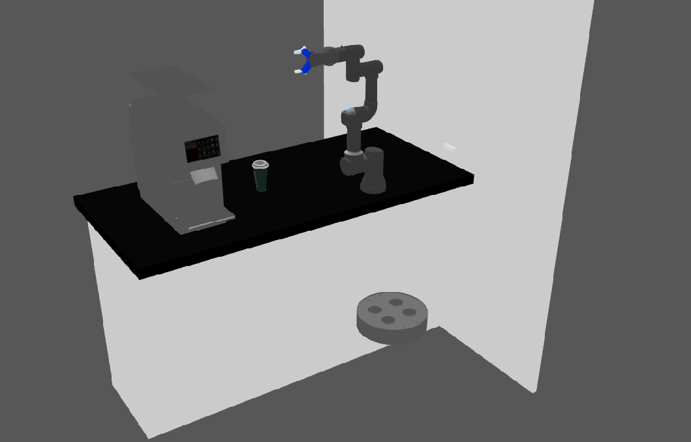

# MasterClass Project

<a name="readme-top"></a>

<!-- TABLE OF CONTENTS -->
<details>
  <summary>Table of Contents</summary>
  <ol>
    <li>
      <a href="#about-the-project">About The Project</a>
    </li>
    <li>
      <a href="#getting-started">Getting Started</a>
      <ul>
        <li><a href="#software-prerequisites">Software Prerequisites</a></li>
        <li><a href="#hardware-prerequisites">Hardware Prerequisites</a></li>
        <li><a href="#installation">Installation</a></li>
      </ul>
    </li>
    <li><a href="#usage">Usage</a></li>
    <li><a href="#real-robot">Real Robot</a></li>
  </ol>
</details>


## About The Project
Reinforcement learning project for a robotic arm, the main goal is to train the arm to pick up a coffee cup and place it
on a delivery robot platform. 



<!-- GETTING STARTED -->
## Getting Started

### Software Prerequisites
* Ubuntu 22.04
* ROS2 Humble
* Docker
* Docker-compose


<p align="right">(<a href="#readme-top">back to top</a>)</p>

<!-- INSTALLATION -->
### Installation
1. Clone the repo:
   ```sh
   cd ~ && \
   git clone https://github.com/pvela2017/The-Construct-Starbots-Coffee-Shop
   ```
2. Compile the image:
   ```sh
   cd masterclass-project/docker && \
   docker build .
   ```
3. Tag the image:
   ```sh
   docker image tag XXXXX mefistocl/masterclassproject:latest
   ```
4. Setup the docker compose file:
   ```yaml
   environment:
      - DISPLAY=:0 # Select the dispaly to be shared, can be replaced by $DISPLAY
      - GAZEBO_MODEL_PATH=/root/ros2_ws/src/the_construct_office_gazebo/models:/root/ros2_ws/src/the_construct_office_gazebo/barista_ros2/barista_description:/root/ros2_ws/src/ur_arm:$${GAZEBO_MODEL_PATH} # No need to change
   volumes:
      - /tmp/.X11-unix:/tmp/.X11-unix # No need to change
      - /dev/shm:/dev/shm  # No need to change
      - /home/mefisto/masterclass/ros2_ws:/root/ros2_ws # Change the first part to your ros2_ws path
   ```
     
<p align="right">(<a href="#readme-top">back to top</a>)</p>


<!-- USAGE -->
## Usage
### Local Simulation
1. Allow the container to use the screen:
   ```sh
   xhost +
   ```
2. Start the container:
   ```sh
   docker-compose run masterclass_project /bin/bash
   ```
3. Compile and launch the simulation:
   ```sh
   cd /root/ros2_ws && \
   colcon build && \
   source /root/ros2_ws/install/setup.bash && \
   ros2 launch the_construct_office_gazebo starbots_ur3e.launch.xml
   ```
4. Moveit:
   ```sh
   source /root/ros2_ws/install/setup.bash && \
   ros2 launch my_moveit_config move_group.launch.py && \
   ros2 launch my_moveit_config moveit_rviz.launch.py
   ```
5. Barista robot detector:
   ```sh
   source /root/ros2_ws/install/setup.bash && \
   ros2 launch hole_detector hole_detector_sim.launch.py
   ```
6. Pick and Place:
   ```sh
   source /root/ros2_ws/install/setup.bash && \
   ros2 launch pick_and_place pick_and_place_perception_sim.launch.py
   ```

### Webpage
1. Start the web application:
   ```sh
   cd /root/webpage_ws && \
   http-server --port 7000 # Locally
   ```
2. Launch the rosbridge node:
   ```sh
   ros2 launch rosbridge_server rosbridge_websocket_launch.xml
   ```
3. Launch the web video server node:
   ```sh
   ros2 run web_video_server web_video_server
   ```
4. Connect to the website:
   ```sh
   https://ip/webpage/
   ```  

<p align="right">(<a href="#readme-top">back to top</a>)</p>

<!-- REAL ROBOT -->
## The construct
### Usage Real Robot
1. Install packages:
   ```sh
   sudo apt update && \
   sudo apt install -y ros-humble-async-web-server-cpp
   ```
2. Compile:
   ```sh
   cd ~/ros2_ws && \
   rm -rf ./src/gazebo_ros_pkgs && \
   colcon build && \
   source ~/ros2_ws/install/setup.bash
   ```
3. Check hardware is working properly:
   ```sh
   ros2 param set /D415/D415 enable_color True && \
   ros2 param set /D415/D415 enable_depth True && \
   ros2 param set /D415/D415 rgb_camera.profile 480x270x6 && \
   ros2 param set /D415/D415 depth_module.profile 480x270x6 && \
   ros2 param set /D415/D415 align_depth.enable True && \
   ros2 control list_controllers
   ```
4. Moveit:
   ```sh
   ros2 launch real_my_moveit_config move_group.launch.py
   ros2 launch real_my_moveit_config moveit_rviz.launch.py
   ```
5. Barista robot detector:
   ```sh
   source ~/ros2_ws/install/setup.bash && \
   ros2 launch hole_detector hole_detector_real.launch.py
   ```
6. Pick and Place:
   ```sh
   source ~/ros2_ws/install/setup.bash && \
   ros2 launch pick_and_place pick_and_place_perception_real.launch.py
   ```
7. Test without website:
   ```sh
   ros2 topic pub /webpage std_msgs/msg/Int16 data:\ 1
   ```

### Webpage
1. Start the web application:
   ```sh
   cd ~/webpage_ws && \
   python3 -m http.server 7000 # The construct website
   ```
2. Launch the rosbridge node:
   ```sh
   ros2 launch rosbridge_server rosbridge_websocket_launch.xml
   ```
3. Launch web video server:
   ```sh
   source ~/ros2_ws/install/setup.bash && \
   ros2 run web_video_server web_video_server --ros-args -p port:=11315
   ```
4. Check the url in the construct, locally the address will be display on the terminal:
   ```sh
   rosbridge_address
   ```
5. Replace the field **rosbridge_address** on the app.js file:
   ```sh
   rosbridge_address: 'wss://i-00cbdc40fcccd3514.robotigniteacademy.com/7e4d6577-22bd-40b2-b93e-1dab1f84d000/rosbridge/',
   ```
6. Connect to the website:
   ```sh
   https://i-072786a1118392265.robotigniteacademy.com/5aa33093-8141-45ca-9477-52ba0c8be6e5/webpage/
   ```

<p align="right">(<a href="#readme-top">back to top</a>)</p>


<!-- NOTES -->
## Notes
* gazebo-ros-pkgs cloned from **ros2** branch fixes the unordered pointcloud obtained in the simulation.
* https://roboticsbackend.com/ros2-package-for-both-python-and-cpp-nodes/
* https://ros2-tutorial.readthedocs.io/en/latest/using_python_library.html
* https://moveit.picknik.ai/humble/doc/examples/move_group_interface/move_group_interface_tutorial.html

<p align="right">(<a href="#readme-top">back to top</a>)</p>


<!-- KEYS -->
## Key topics learnt
* Moveit - plannning with orientation constraint.
* Moveit - Attach object to the arm for planning.
* Perception - Use RGB and Depth aligned image to get object coordinates.
